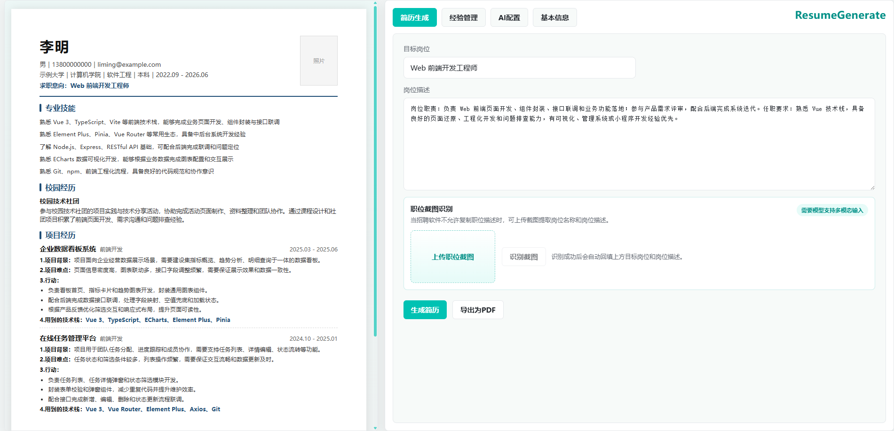

# ResumeGenerate

ResumeGenerate 是一个基于 Vue 3 的 AI 简历生成工作台，面向简历生成、编辑和版本管理场景。应用左侧提供可编辑的简历预览模板，右侧提供基本信息、经验素材、岗位信息、AI 配置和 PDF 导出能力。

# 预览



## 功能特性

- **简历模板预览**：左侧 A4 简历区域支持纵向滚动预览。
- **随处编辑**：简历预览中的文本可直接点击编辑，照片除外。
- **基本信息管理**：维护姓名、性别、手机号、邮箱、学校、专业、求职意向和照片。
- **经验管理**：自由添加经历素材，支持项目、实习、校园经历、比赛、工作经历等内容。
- **AI 简历生成**：根据经验素材和目标岗位自动生成专业技能、校园经历、项目经历。
- **板块智能保留**：AI 会判断专业技能、校园经历、项目经历是否需要保留。
- **生成进度反馈**：生成过程中右侧显示进度条，左侧对应区域显示骨架屏。
- **职位截图识别**：当招聘软件不允许复制岗位描述时，可上传职位截图，由支持多模态输入的模型提取岗位名称和岗位描述。
- **OpenAI 兼容接口**：可配置接口请求地址、API Key、模型 ID，并支持普通模型 / 思考模型模式。
- **PDF 导出**：将左侧简历区域直接导出为 PDF。
- **本地存储**：AI 配置、基本信息、经验素材保存在浏览器本地。

## 技术栈

- Vue 3
- Vite
- html2canvas
- jsPDF
- OpenAI-compatible Chat Completions API

## 快速开始

```bash
npm install
npm run dev
```

开发服务默认运行在：

```text
http://127.0.0.1:5173
```

生产构建：

```bash
npm run build
```

本地预览构建产物：

```bash
npm run preview
```

## AI 配置

在应用右侧进入 `AI配置`，填写：

- `接口请求地址`：OpenAI 兼容的 Chat Completions 地址，例如 `https://api.openai.com/v1/chat/completions`
- `API Key`：接口密钥
- `模型 ID`：例如 `gpt-4o-mini`
- `思考模型`：如果模型会输出 reasoning / thinking 内容，可开启该开关

点击 `测试链接` 可检查接口是否可用，点击 `保存配置` 后会写入浏览器本地存储。

## 多模态截图识别

`简历生成` 页面支持上传招聘软件截图，并自动识别：

- 目标岗位
- 岗位描述

该功能要求当前模型支持图片输入。接口需要兼容 OpenAI 多模态消息格式：

```json
{
  "type": "image_url",
  "image_url": {
    "url": "data:image/png;base64,..."
  }
}
```

## 简历生成流程

1. 在 `经验管理` 中填写过往经历，内容越具体越好，可以包含校园经历。
2. 在 `简历生成` 中填写目标岗位和招聘平台 HR 发布的岗位描述。
3. 点击 `生成简历`。
4. 系统先判断需要保留的简历板块。
5. AI 分别生成专业技能、校园经历、项目经历。
6. 左侧简历预览实时更新。
7. 可继续手动编辑预览内容。
8. 点击 `导出为PDF` 下载简历。

## 数据与隐私

- `基本信息` 不会提交给 AI。
- AI 生成只使用 `经验管理` 和 `简历生成` 页面中的岗位信息。
- 应用配置和草稿默认保存在浏览器 `localStorage`。
- 请不要在公开仓库中提交真实 API Key。

## 项目结构

```text
src/
  components/          Vue 组件
  constants/           本地存储 key
  data/                默认简历模板和默认表单数据
  services/            AI 调用与解析逻辑
  App.vue              应用状态与主流程
  main.js              Vue 入口
  style.css            全局样式
```

## 注意事项

- PDF 导出依赖浏览器渲染，建议在桌面浏览器中使用。
- 不同 OpenAI-compatible 服务对 `response_format`、思考模型和多模态输入的支持不完全一致。
- 如果使用思考模型，建议在 `AI配置` 中开启 `思考模型` 开关。
- 职位截图识别需要模型支持多模态输入，否则会识别失败。
